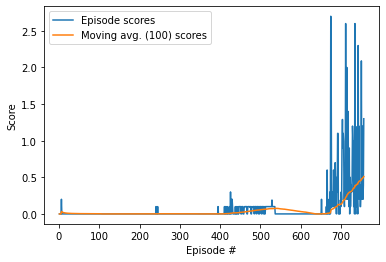

# Project report

## Learning Algorithm

The learning algorithm used in this project is the multi agent DDPG algorithm, described in this [paper](https://arxiv.org/pdf/1706.02275.pdf) (check out Algorithm 1). In this particular environment there are two agents, one on each side of the tennis court. Each agent has its own actor and there is a centralised critic. The buffer of experience replay is also shared. Check [agentcommon.py](aggentcommon.py) for more details.

Both actor and critic models consist of fully connected layers, usually followed by ReLU activation functions, normalisation layers, and a Tanh activation shaping the action space of the actors. For details, please check [model.py](model.py).


## Plot of Rewards



```
Episode 100	Average Score: 0.00
Episode 200	Average Score: 0.00
Episode 300	Average Score: 0.00
Episode 400	Average Score: 0.00
Episode 500	Average Score: 0.06
Episode 600	Average Score: 0.03
Episode 700	Average Score: 0.13
Solved in 757 episodes, with mean score: 0.51
```

## Trained model

The trained weights 

- [Actor 1](https://github.com/agutierreza/drl-unity-tennis/blob/master/checkpoint_actorL.pth)
- [Actor 2](https://github.com/agutierreza/drl-unity-tennis/blob/master/checkpoint_actorR.pth)
- [Critic](https://github.com/agutierreza/drl-unity-tennis/blob/master/checkpoint_critic.pth)


## Ideas for future work

The first thing I would try is to see how implementing prioritised experience replay (check paper [here](https://arxiv.org/pdf/1511.05952.pdf)) would affect training.
